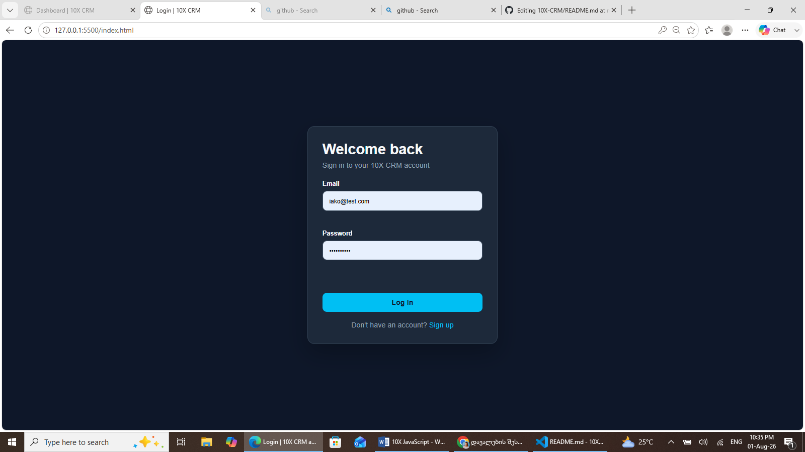
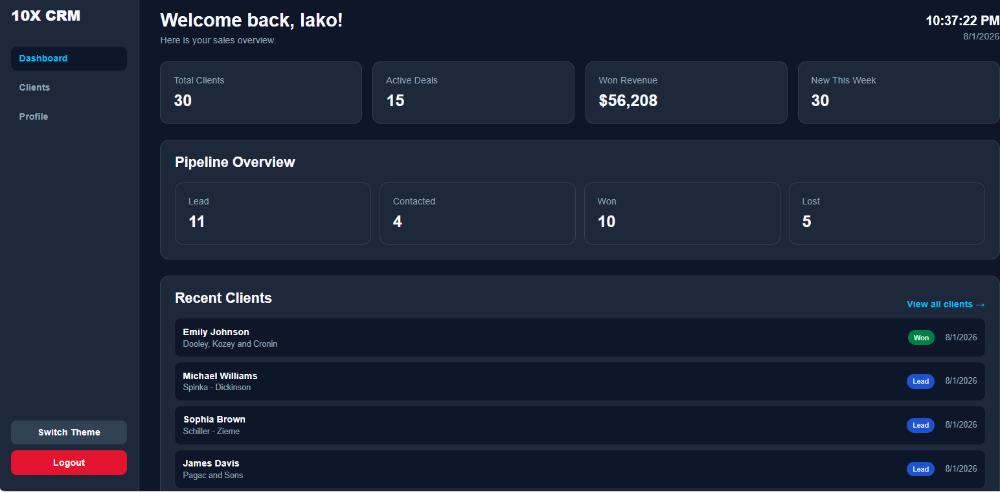
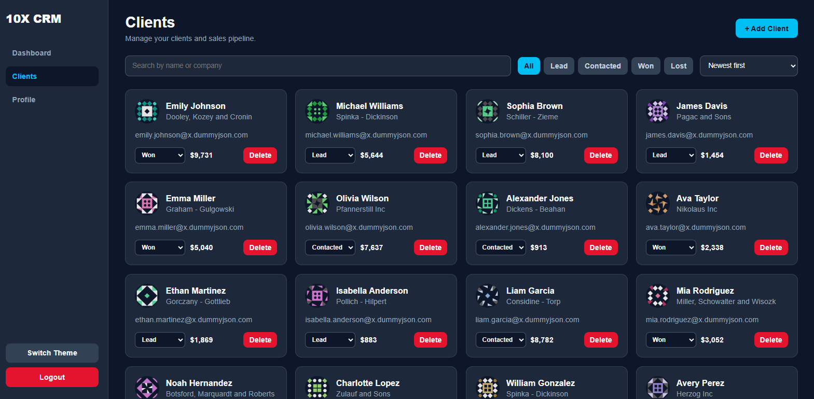
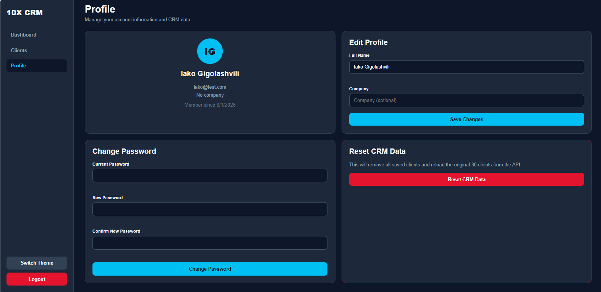

# 10X CRM

A modern CRM (Customer Relationship Management) web application built with Vanilla JavaScript.

## Features

- User registration
- User login
- Authentication with Local Storage
- Dashboard with statistics
- Client management
- Search clients
- Filter by status
- Sort clients
- Add new clients
- Delete clients
- Update client status
- Client details modal
- Client notes
- Reminder button
- User profile
- Edit profile
- Change password
- Reset CRM data
- Dark / Light theme
- Responsive design

## Technologies

- HTML5
- CSS3
- JavaScript (ES6)
- LocalStorage API
- Fetch API
- DummyJSON API

## Project Structure

```
10X-CRM
│
├── css
│   ├── style.css
│   └── clients.css
│
├── js
│   ├── common.js
│   ├── storage.js
│   ├── guard.js
│   ├── login.js
│   ├── signup.js
│   ├── dashboard.js
│   ├── clients.js
│   ├── profile.js
│   └── data.js
│
├── index.html
├── signup.html
├── dashboard.html
├── clients.html
├── profile.html
└── README.md
```

## Installation

Clone the repository

```bash
git clone https://github.com/YOUR_USERNAME/10X-CRM.git
```

Open the project

```bash
cd 10X-CRM
```

Run Live Server

## Demo Account

Email

```
iako@test.com
```

Password

```
test1234
```

## API

https://dummyjson.com

## Screenshots

### Login



### Dashboard



### Clients



### Profile




## Author

Ia Gigolashvili